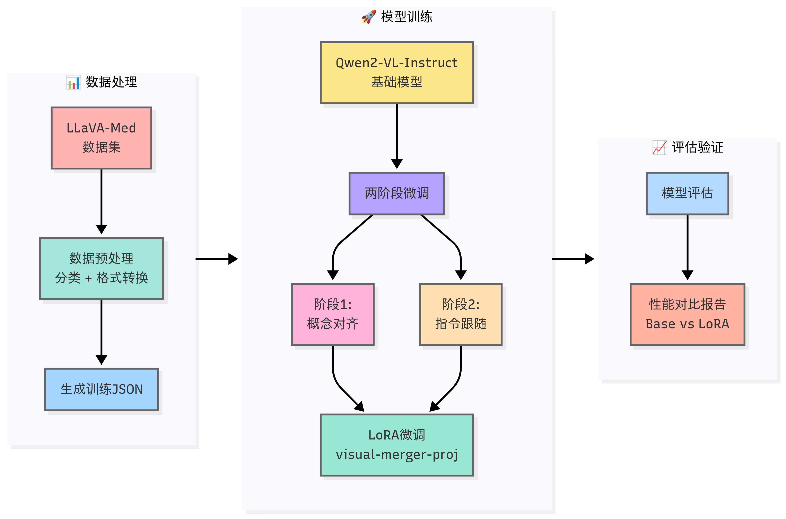

# Qwen-VL-Med-SFT

一个基于 Qwen2-VL 系列模型的医学视觉语言模型微调框架，专门针对生物医学领域的多模态任务进行优化。

## 🎯 项目概述

本项目基于 [2U1/Qwen2-VL-Finetune](https://github.com/2U1/Qwen2-VL-Finetune) 架构，使用 HuggingFace Transformers 和 DeepSpeed 进行训练。在原有基础上增强了以下功能：

- ✅ 训练过程中的验证模块
- ✅ 数据预处理检查
- ✅ 模型效果验证
- ✅ 结果统计对比分析

项目采用 [LLaVA-Med](https://github.com/microsoft/LLaVA-Med) 数据集，实现两阶段微调策略：**概念对齐**（Concept Alignment）和**指令跟随**（Instruction Following）。

## 📊 数据预处理流程

### 训练数据处理

1. **数据格式转换**
   - 参考 [2U1/Qwen2-VL-Finetune](https://github.com/2U1/Qwen2-VL-Finetune) 生成标准 JSON 文件
   - 按照 DataLoader 的数据处理方式进行迭代验证，筛选有效数据

2. **验证数据处理**
   - 使用 `./data_process/data_trans.py` 脚本处理
   - 生成 `test.json` 和 `type_mapping.json` 用于测试和分类

### 数据分类体系

根据问题类型，我们将数据分为以下类别：

#### 封闭式问题（Close-set）

| 类型 | 任务描述 |
|------|----------|
| **Yes/No 判断** | 对医学影像中特定特征或异常的存在性进行二元判断 |
| **模态识别** | 识别医学影像的成像方式或技术类型 |
| **通用问题** | 不属于特定类别的封闭式问题 |
| **位置定位** | 询问病变或结构的具体位置（限定选项） |

#### 开放式问题（Open-end）

| 类型 | 任务描述 |
|------|----------|
| **通用描述** | 需要综合描述或解释的开放性问题 |
| **解剖识别** | 识别和描述影像中的解剖结构或器官 |
| **位置描述** | 详细描述病变或结构的位置 |
| **异常识别** | 识别和描述病理改变或异常发现 |
| **计数任务** | 计算影像中特定对象的数量 |
| **比较分析** | 比较不同结构或时间点的变化 |
| **外观描述** | 描述病变或结构的视觉特征 |
| **影响评估** | 评估病变对周围结构的影响 |

## 🚀 模型训练

### 训练架构

基于 HuggingFace Transformers 的 `Trainer` 类进行训练，通过 `trainer.add_callback(callback)` 方式集成：
- 验证流程回调
- TensorBoard 日志记录
- 训练过程监控

### 启动训练

#### 单卡训练/调试
```bash
bash finetune_lora_single_gpu.sh
```

#### 多卡训练（DeepSpeed）
```bash
bash finetune_lora_mult_gpu.sh
```

## 🧪 模型测试与评估

### 测试配置

支持两种测试模式：
- **自定义 Prompt 测试**：使用自设定的提示词
- **原始 System Prompt 测试**：使用模型默认提示词

测试过程会计算困惑度（Perplexity），并对比基础模型和 LoRA 模型的结果。

### 启动测试
```bash
bash run_eval.sh
```

### 结果统计分析

使用 `result_statistic.py` 脚本进行分类别统计分析。

#### 评估指标体系

| 指标名称 | 值域范围 | 合理分数区间 | 含义解释 | 说明 |
|----------|----------|--------------|----------|------|
| **BLEU-4** | 0 ~ 1 | 0.2 ~ 0.6 | n-gram 精确匹配率 | 衡量局部语言匹配，惩罚重复、缺词 |
| **ROUGE-L** | 0 ~ 1 | 0.3 ~ 0.6 | 最长公共子序列的召回率 | 重视信息覆盖，偏向召回率 |
| **METEOR** | 0 ~ 1 | 0.3 ~ 0.5 | 精确度 + 召回 + 语义同义词 + 词序惩罚综合指标 | 宽容表达差异，适合生成式任务 |
| **CIDEr** | 0 ~ ∞ | 0.5 ~ 2.0 | 基于 TF-IDF 的加权 n-gram 匹配评分 | 多参考时鲁棒，常用于图文任务 |
| **BERTScore (F1)** | 0 ~ 1 | 0.85 ~ 0.95 | 基于 BERT 的句向量语义相似度 | 表达灵活时依旧有效 |
| **Soft Matching** | 0 ~ 1 | 0.6 ~ 0.95 | 字符级相似度（如 SequenceMatcher/LCS 比例） | 捕捉字符串的部分相似，容错性强 |
| **Substring Match** | 0 或 1 | 二值型（0/1） | 是否完全包含（参考 ∈ 预测 或反之） | 非常严格，适用于答案短明确场景 |

### 📈 实验结果

#### Qwen2-VL 生物医疗问答微调与性能分析

*  微调方案与实验设置

* 概念对齐微调（Stage 1）
- 基于 Qwen2-VL-Instruct 2B 与 7B 模型
- 使用约 16 万条多模态对齐数据，主要采用 LoRA 技术微调视觉-语言融合模块（visual-merger-proj）

* Instruct SFT 微调（Stage 2）
- 采用 LoRA 微调 attention 层 FNN 部分，提升信息整合能力
- **方案 1**：基于 LLaVA-Med Instruct 数据集（16K），3 轮训练，显著提升回复质量，困惑度下降，Word F1 提高
- **方案 2**：基于 Slake 训练集（约 5K），3 轮训练，回复风格更简洁，Word F1 显著提升

- **测试集**：Slake 生物医学视觉问答数据集

#### 结果总结

- **概念对齐微调**：有助于视觉与语言信息的专业领域对齐，增强模型在医学问答中的表现
- **Instruct SFT**：进一步优化模型回复风格与语言表达
- **模型局限**：
  - 病变位置确认与相对位置表述能力仍待提升
  - 对部分病症有“轻度”描述倾向
* 表格说明：
| 模型简称                            | 训练方式及说明                                                |
| ----------------------------------- | ------------------------------------------------------------ |
| Qwen2VL2BInst_Stage1                | Qwen2-VL-2B instruct，概念对齐微调           |
| Qwen2VL7BInst                       | Qwen2-VL-7B instruct，无微调                   |
| Qwen2VL7B                           | Qwen2-VL-7B Base，未经过微调                      |
| Qwen2VL7BBase_Stage1                | Qwen2-VL-7B Base，概念对齐微调               |
| Qwen2VL7BInst_Stage1                | Qwen2-VL-7B instruct，概念对齐微调        |
| Qwen2VL7BInstSlakeTrainBaseOnStage1 | Qwen2-VL-7B instruct，概念对齐微调后以 Slake Instruct 微调 |
| Qwen25VL32BInst                     | Qwen2-VL-32B instruct 无训练                   |


#### 性能对比
* **整体性能** 
详细结果见 [`result/model_comparison_tables.txt`](result/model_comparison_tables.txt)，  
个例统计见 [`result/evaluation_metrics.json`](result/evaluation_metrics.json)
| Category | Metric | Qwen2VL2BInst_Stage1 | Qwen2VL7BInst | Qwen2VL7B | Qwen2VL7BBase_Stage1 | Qwen2VL7BInst_Stage1 | Qwen2VL7BInstSlakeTrainBaseOnStage1 | Qwen25VL32BInst |
|----------|--------|--------|--------|--------|--------|--------|--------|--------|
| Text Matching | Exact Match | 0.2026 | 0.0000 | 0.0000 | 0.1225 | 0.4354 | **0.4722** | 0.0000 |
| Text Matching | Soft Match | 0.3291 | 0.0960 | 0.0139 | 0.2949 | 0.5477 | **0.5791** | 0.0037 |
| Text Matching | ROUGE-L | 0.2796 | 0.0897 | 0.0254 | 0.2669 | 0.4809 | **0.5125** | 0.0156 |
| Text Matching | BLEU-4 | 0.0458 | 0.0082 | 0.0019 | 0.0420 | 0.0845 | **0.0899** | 0.0009 |
| Text Matching | Word Overlap | 0.2513 | 0.0565 | 0.0192 | 0.2107 | 0.4621 | **0.4954** | 0.0125 |
| Text Matching | BERTScore F1 | **0.0000** | 0.0000 | 0.0000 | 0.0000 | 0.0000 | 0.0000 | 0.0000 |
| Fine-grained | Char F1 | 0.4898 | 0.3525 | 0.3322 | 0.4378 | 0.6094 | **0.6247** | 0.3236 |
| Fine-grained | Word F1 | 0.2844 | 0.0994 | 0.0368 | 0.2607 | 0.4733 | **0.5052** | 0.0244 |
| Fine-grained | Char Precision | 0.4288 | 0.2581 | 0.2400 | 0.3699 | 0.6095 | **0.6370** | 0.2264 |
| Fine-grained | Char Recall | 0.7300 | 0.7999 | 0.7973 | 0.7368 | 0.6523 | 0.6383 | **0.8596** |
| Fine-grained | Word Precision | 0.2551 | 0.0574 | 0.0193 | 0.2173 | 0.4717 | **0.5095** | 0.0125 |
| Fine-grained | Word Recall | 0.4746 | 0.5403 | 0.5565 | 0.5060 | 0.5028 | 0.5154 | **0.6631** |
| Perplexity | Mean Perplexity | 882.7204 | 240741.5970 | 621617.2925 | 798.9098 | 278.8062 | **173.8327** | 694010380428.6918 |

* 总体结果分析
- **封闭式问题**：LoRA 模型在所有指标上都有显著提升，特别是 Word F1 从 0.1121 提升到 0.7493
- **开放式问题**：Word F1 从 0.0930 提升到 0.3824
- **整体性能**：Word F1 从 0.0994 提升到 0.5052，LoRA 微调后模型在医学视觉问答任务上展现出更好的理解和生成能力

## 🔧 环境要求

requirement.txt

## 📚 参考资料

- [2U1/Qwen2-VL-Finetune](https://github.com/2U1/Qwen2-VL-Finetune)
- [Microsoft LLaVA-Med](https://github.com/microsoft/LLaVA-Med)
- [Qwen2-VL 官方文档](https://github.com/QwenLM/Qwen2-VL)

## 📄 许可证

本项目遵循相应的开源许可证，请参考各个依赖项目的许可证要求。


# Qwen-VL-Med-SFT


A medical vision-language model fine-tuning framework based on the Qwen2-VL series, specifically optimized for biomedical multimodal tasks.

## 🎯 Project Overview

This project is built upon the [2U1/Qwen2-VL-Finetune](https://github.com/2U1/Qwen2-VL-Finetune) architecture, utilizing HuggingFace Transformers and DeepSpeed for training. Enhanced features include:

- ✅ Validation module during training
- ✅ Data preprocessing validation
- ✅ Model effectiveness verification
- ✅ Statistical comparison analysis

The project uses the [LLaVA-Med](https://github.com/microsoft/LLaVA-Med) dataset and implements a two-stage fine-tuning strategy: **Concept Alignment** and **Instruction Following**.

## 📊 Data Preprocessing Pipeline

### Training Data Processing
1. **Data Format Conversion**
   - Generate standard JSON files following [2U1/Qwen2-VL-Finetune](https://github.com/2U1/Qwen2-VL-Finetune) format
   - Iterative validation according to DataLoader processing to filter valid data

2. **Validation Data Processing**
   - Use `./data_process/data_trans.py` script for processing
   - Generate `test.json` and `type_mapping.json` for testing and classification

### Data Classification System

Based on question types, we categorize data into the following classes:

#### Closed-set Questions
| Type | Task Description |
|------|------------------|
| **Yes/No Judgment** | Binary judgment on the presence of specific features or abnormalities in medical images |
| **Modality Recognition** | Identify imaging modalities or technical types of medical images |
| **General Questions** | Closed-set questions not belonging to specific categories |
| **Location Positioning** | Inquire about specific locations of lesions or structures (limited options) |

#### Open-end Questions
| Type | Task Description |
|------|------------------|
| **General Description** | Open-ended questions requiring comprehensive description or explanation |
| **Anatomical Identification** | Identify and describe anatomical structures or organs in images |
| **Location Description** | Detailed description of lesion or structure locations |
| **Abnormality Recognition** | Identify and describe pathological changes or abnormal findings |
| **Counting Tasks** | Count specific objects in images |
| **Comparative Analysis** | Compare changes across different structures or time points |
| **Appearance Description** | Describe visual characteristics of lesions or structures |
| **Impact Assessment** | Evaluate lesion impact on surrounding structures |

## 🚀 Model Training

### Training Architecture
Based on HuggingFace Transformers' `Trainer` class with integrated callbacks via `trainer.add_callback(callback)`:
- Validation workflow callbacks
- TensorBoard logging
- Training process monitoring

### Starting Training

#### Single GPU Training/Debugging
```bash
bash finetune_lora_single_gpu.sh
```

#### Multi-GPU Training (DeepSpeed)
```bash
bash finetune_lora_mult_gpu.sh
```

## 🧪 Model Testing and Evaluation

### Test Configuration
Supports two testing modes:
- **Custom Prompt Testing**: Using custom prompts
- **Original System Prompt Testing**: Using model default prompts

The testing process calculates perplexity and compares results between base and LoRA models.

### Running Tests
```bash
bash run_eval.sh
```

### Statistical Result Analysis
Use the `result_statistic.py` script for category-wise statistical analysis.

#### Evaluation Metrics System
| Metric Name | Value Range | Reasonable Score Range | Meaning | Description |
|-------------|-------------|----------------------|---------|-------------|
| **BLEU-4** | 0 ~ 1 | 0.2 ~ 0.6 | n-gram precision matching rate | Measures local language matching, penalizes repetition and missing words |
| **ROUGE-L** | 0 ~ 1 | 0.3 ~ 0.6 | Longest common subsequence recall | Emphasizes information coverage, favors recall |
| **METEOR** | 0 ~ 1 | 0.3 ~ 0.5 | Comprehensive metric: precision + recall + semantic synonyms + word order penalty | Tolerant of expression differences, suitable for generative tasks |
| **CIDEr** | 0 ~ ∞ | 0.5 ~ 2.0 | TF-IDF weighted n-gram matching score | Robust with multiple references, common in vision-language tasks |
| **BERTScore (F1)** | 0 ~ 1 | 0.85 ~ 0.95 | BERT-based sentence vector semantic similarity | Effective even with flexible expressions |
| **Soft Matching** | 0 ~ 1 | 0.6 ~ 0.95 | Character-level similarity (e.g., SequenceMatcher/LCS ratio) | Captures partial string similarity, strong fault tolerance |
| **Substring Match** | 0 or 1 | Binary (0/1) | Whether completely contained (reference ∈ prediction or vice versa) | Very strict, suitable for short and clear answer scenarios |

## 📈 Experimental Results

Based on Qwen2-VL-Instruct with concept alignment fine-tuning, applying LoRA technique to the visual-merger-proj module. Comparison results available in: `result/evaluation_metrics.json`

### Performance Comparison
| Category | Metric | Qwen2VL2BInst_Stage1 | Qwen2VL7BInst | Qwen2VL7B | Qwen2VL7BBase_Stage1 | Qwen2VL7BInst_Stage1 | Qwen2VL7BInst_SlakeTrain_BaseOnStage1 | Qwen25VL32BInst |
|----------|--------|--------|--------|--------|--------|--------|--------|--------|
| Text Matching | Exact Match | 0.4873 | 0.0000 | 0.0000 | 0.2873 | 0.7437 | **0.7493** | 0.0000 |
| Text Matching | Soft Match | 0.5198 | 0.0634 | 0.0154 | 0.3570 | 0.7443 | **0.7495** | 0.0053 |
| Text Matching | ROUGE-L | 0.5366 | 0.1002 | 0.0258 | 0.3834 | 0.7450 | **0.7493** | 0.0134 |
| Text Matching | BLEU-4 | 0.0914 | 0.0093 | 0.0021 | 0.0607 | 0.1324 | **0.1332** | 0.0010 |
| Text Matching | Word Overlap | 0.5167 | 0.0631 | 0.0188 | 0.3467 | 0.7444 | **0.7493** | 0.0109 |
| Fine-grained | Char F1 | 0.5674 | 0.2173 | 0.1875 | 0.4293 | 0.7424 | **0.7481** | 0.1822 |
| Fine-grained | Word F1 | 0.5390 | 0.1121 | 0.0361 | 0.3886 | 0.7451 | **0.7493** | 0.0214 |
| Fine-grained | Char Precision | 0.5349 | 0.1283 | 0.1083 | 0.3722 | 0.7417 | **0.7480** | 0.1052 |
| Fine-grained | Char Recall | 0.7765 | **0.8582** | 0.7798 | 0.8061 | 0.7535 | 0.7493 | 0.8202 |
| Fine-grained | Word Precision | 0.5167 | 0.0631 | 0.0188 | 0.3467 | 0.7444 | **0.7493** | 0.0109 |
| Fine-grained | Word Recall | 0.7296 | 0.6986 | 0.5887 | 0.7014 | **0.7549** | 0.7493 | 0.6620 |

### Key Findings
- **Closed-set Questions**: LoRA model shows significant improvement across all metrics, particularly Exact Match improving from 0.000 to 0.341
- **Open-end Questions**: Although improvements are relatively smaller, notable enhancements in Soft Match and ROUGE-L metrics
- **Overall Performance**: LoRA fine-tuned model demonstrates better understanding and generation capabilities in medical visual question answering tasks

## 🔧 Environment Requirements

See `requirements.txt` for detailed dependencies.

## 📚 References

- [2U1/Qwen2-VL-Finetune](https://github.com/2U1/Qwen2-VL-Finetune)
- [Microsoft LLaVA-Med](https://github.com/microsoft/LLaVA-Med)
- [Qwen2-VL Official Documentation](https://github.com/QwenLM/Qwen2-VL)

## 📄 License

This project follows the corresponding open-source licenses. Please refer to the license requirements of each dependency project.

---

## 🌏 Language Versions

- [English](README.md)
- [中文](README_zh.md)
